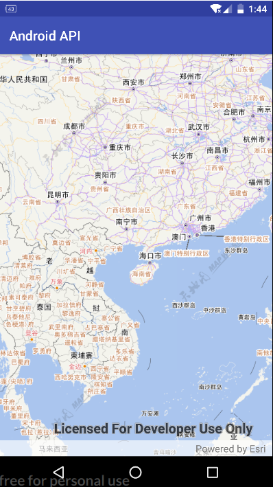

# ArcGIS-Android-TianDiTu
ArcGIS Runtime SDK 100.1 for Android 加载国家天地图切片服务。
可以通过两种方式：
* 通过扩展ImageTiledLayer
* 通过WebTiledLayer

## 通过扩展ImageTiledLayer
### 扩展ImageTiledLayer需要重载两个方法
（1）构建函数
```java
public TianDiTuLayer(TileInfo tileInfo, Envelope fullExtent) {
    super(tileInfo, fullExtent);
}
```

（2）getTile()
```java
@Override
protected byte[] getTile(TileKey tileKey) {
    int level = tileKey.getLevel();
    int col = tileKey.getColumn();
    int row = tileKey.getRow();
}
```

## 通过WebTiledLayer
通过不同的参数（服务类型、图层名、类型）加载不同类型的切片。

获得某个切片的服务地址：http://t0.tianditu.com/vec_c/wmts?service=wmts&request=gettile&version=1.0.0&layer=vec&STYLE=default&tilematrixset=c&tilematrix=3&tilerow=3&tilecol=4&format=tiles

切片


需要请求不同的切片时，vec_c代表请求的服务地址，layer是请求的图层，tilematrixset区分投影坐标系和地理坐标系，format是图片格式。

## 效果图


